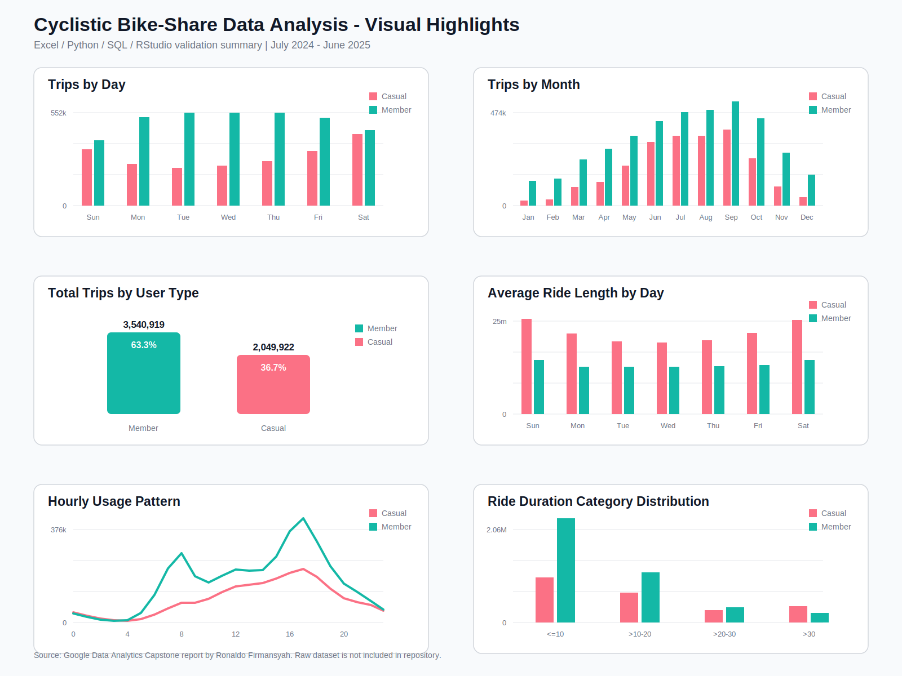

# Cyclistic Bike-Share Data Analysis

End-to-end bike-share data analysis project using **Excel / Power Query, SQL, Python, and RStudio** to compare usage behavior between **casual riders** and **annual members**, then generate data-driven marketing recommendations to support annual membership conversion.

This project was completed as part of the **Google Data Analytics Capstone** case study and is presented as a professional data analytics portfolio project.

---

## Business Problem

Cyclistic is a fictional bike-share company in Chicago. The company wants to increase the number of annual members because annual members are considered more profitable than casual riders.

The business objective of this project is to understand how casual riders and annual members use Cyclistic bikes differently, then translate those behavioral differences into practical marketing recommendations that can help convert casual riders into annual members.

This analysis answers three key business questions:

1. How do annual members and casual riders use Cyclistic bikes differently?
2. Why would casual riders buy an annual Cyclistic membership?
3. How can Cyclistic use digital media to influence casual riders to become annual members?

---

## Dataset

The dataset used in this project is historical bike-share trip data from Cyclistic / Divvy.

| Item | Description |
|---|---|
| Dataset period | July 2024 - June 2025 |
| Dataset type | Historical bike-share trip records |
| User types | Casual riders and annual members |
| Main fields used | `ride_id`, `rideable_type`, `started_at`, `ended_at`, `member_casual`, `ride_length`, `day_of_week`, `month`, `hour`, `category_ride_length` |
| Raw data status | Not uploaded to this repository to keep the repository lightweight |

The raw dataset is public and used only for educational and portfolio purposes. Raw files are not stored in this repository because of file size limitations and repository cleanliness.

---

## Assumptions

Several assumptions were applied during the analysis:

1. Each row represents one bike trip.
2. `member` represents annual members.
3. `casual` represents non-member or casual riders.
4. Trips with missing critical values were removed during the cleaning process.
5. Trips with duration less than or equal to 0 minutes were considered invalid.
6. Trips longer than 24 hours were treated as abnormal ride records and excluded from the final cleaned dataset.
7. The dataset does not contain unique user identifiers, so individual rider behavior cannot be tracked over time.
8. Because user-level identification is unavailable, this analysis focuses on aggregate behavior by user type, time, and ride duration.

---

## Methodology

The analysis followed an end-to-end data analytics workflow:

1. **Ask**  
   Defined the business problem and key questions around membership conversion.

2. **Prepare**  
   Collected 12 months of historical bike-share trip data covering July 2024 to June 2025.

3. **Process**  
   Cleaned the data by removing duplicates, blank rows, irrelevant columns, invalid ride durations, and extreme ride durations above 24 hours.

4. **Transform**  
   Created additional analytical fields such as `ride_length`, `hour`, `month`, `day_of_week`, and `category_ride_length`.

5. **Analyze**  
   Compared casual riders and annual members across total trips, average ride duration, daily pattern, hourly pattern, monthly trend, and ride duration category.

6. **Share**  
   Produced summary tables, charts, dashboard-style visuals, and documentation using Excel, SQL, Python, RStudio, and Markdown.

7. **Act**  
   Generated marketing recommendations based on observed rider behavior.

---

## SQL Queries

SQL was used as the main tool for data cleaning, transformation, and structured analysis. The SQL workflow includes table creation, data preparation, feature engineering, and analytical queries.

Main SQL tasks:

- Import raw trip data into a database environment.
- Remove invalid and abnormal trip records.
- Create `ride_length` based on trip start and end time.
- Create time-based columns such as `hour`, `month`, and `day_of_week`.
- Create ride duration categories.
- Compare ride behavior between `member` and `casual` users.

Example query:

```sql
SELECT
    member_casual,
    COUNT(*) AS total_trips,
    AVG(ride_length) AS avg_ride_length
FROM rides_cleaned
GROUP BY member_casual;
```

SQL analysis covered:

- Total trips by user type
- Average ride duration by user type
- Trips by day of week
- Trips by hour
- Monthly usage trends
- Ride duration category distribution

Related files:

| File | Description |
|---|---|
| [`sql/README.md`](sql/README.md) | SQL workflow assumptions and query coverage |
| [`sql/analysis_queries.sql`](sql/analysis_queries.sql) | SQL templates for analysis queries |

---

## Python Analysis

Python was used for additional validation, exploratory analysis, and visualization.

Main Python libraries:

- `pandas`
- `numpy`
- `matplotlib`
- `seaborn`

Python was used to:

- Validate cleaned data outputs.
- Analyze usage patterns by user type.
- Create visual comparisons between casual riders and annual members.
- Explore trip frequency, average duration, daily pattern, hourly pattern, and monthly trend.

Key analysis areas:

1. Number of trips by user type
2. Average ride duration by user type
3. Trip distribution by day of week
4. Trip distribution by hour
5. Monthly ride trend
6. Ride duration category comparison

---

## Dashboard

This repository includes a dashboard-style visual summary to communicate the main findings clearly and quickly.



The dashboard-style summary highlights:

- Total trips by user type
- Average ride length by user type
- Usage pattern by day of week
- Monthly ride trends
- Ride duration behavior
- Conversion opportunity for casual riders

The objective of this visual summary is to help stakeholders understand how casual riders and annual members behave differently, then use those insights to support membership conversion strategy.

---

## Key Metrics

| Metric | Value |
|---|---:|
| Total trips after cleaning | 5,590,841 |
| Casual rider trips | 2,049,922 |
| Annual member trips | 3,540,919 |
| Average ride length - casual riders | 19.96 minutes |
| Average ride length - annual members | 11.83 minutes |
| Overall average ride length | 14.81 minutes |

---

## Key Findings

### 1. Members ride more consistently throughout the year

Annual members recorded more trips than casual riders overall. Their usage pattern is more stable, especially on weekdays, indicating routine and functional usage such as commuting.

### 2. Casual riders are more weekend and seasonal oriented

Casual riders are more active on weekends, especially Saturday and Sunday. Their usage increases sharply from May to September, which suggests stronger recreational and seasonal behavior.

### 3. Members show commuting behavior

Members are more active during peak commuting hours, especially around **07:00-09:00** and **16:00-18:00**.

### 4. Casual riders take longer rides

Casual riders have longer average ride durations than members. This indicates that casual riders are more likely to use the service for leisure, recreation, or non-routine trips.

### 5. Long-duration rides are a conversion opportunity

Casual riders are more represented in longer ride duration categories, especially trips above 30 minutes. This group has stronger potential to be targeted with membership cost-saving messages.

---

## Recommendation

Based on the findings, Cyclistic should prioritize casual riders who show repeated recreational or long-duration usage patterns. These riders are more likely to understand the value of membership if the message is positioned around convenience, cost savings, and frequent weekend use.

Recommended actions:

### 1. Weekend and summer conversion campaign

Launch targeted conversion campaigns during weekends and peak casual-rider months, especially from May to September.

Example campaign message:

> Try 1 Month Membership for Free This Weekend

### 2. Time-and-duration-based targeting

Use app notifications, email, or in-app ads during casual rider peak activity hours around **11:00-17:00**.

Example message:

> Riding more than 20 minutes? Save more with a monthly membership.

### 3. Digital marketing based on rider behavior

Use social media, email marketing, and location-based campaigns around popular leisure areas, parks, and tourist spots. Highlight membership benefits for weekend trips and longer rides.

### 4. Cost-saving comparison

Show casual riders a simple comparison between repeated single-ride usage and annual membership cost. This can help casual riders recognize when membership becomes financially more attractive.

---

## Future Improvement

This project can be improved by adding more data sources and deeper analytical methods.

Potential improvements:

1. Add unique rider identifiers to analyze repeat user behavior.
2. Add payment or fare data to calculate direct cost-saving opportunities.
3. Add customer demographic data for better segmentation.
4. Add weather data to evaluate seasonal and weather-related riding behavior.
5. Add station-level location analysis to identify high-conversion areas.
6. Build a predictive model for membership conversion likelihood.
7. Build a full interactive Power BI dashboard.
8. Compare results across multiple years to identify long-term behavioral trends.

---

## Documentation Index

| Document | Description |
|---|---|
| [Full Report - Indonesian PDF](docs/Data-Analytics_Ronaldo-Firmansyah.pdf) | Original complete project report in Indonesian |
| [English Portfolio Report - Markdown](docs/Data-Analytics_Ronaldo-Firmansyah_EN.md) | Concise English portfolio report for GitHub review |
| [English Portfolio Report - Secured PDF](docs/Data-Analytics_Ronaldo-Firmansyah_EN.pdf) | English PDF report with restricted copy/extraction/modification permissions in compliant PDF viewers |
| [English Report Note](docs/english_report_note.md) | Notes about the English report files and PDF security limitation |
| [Project Summary](docs/project_summary.md) | Short project summary, methodology, findings, and recommendations |
| [Visual Highlights](outputs/charts/cyclistic_visual_highlights.svg) | Portfolio-ready visual summary of the main analysis results |
| [Excel / Power Query Workflow](excel/power_query_workflow.md) | Excel cleaning and transformation steps |
| [Excel Analysis Results](excel/excel_results_summary.md) | Excel Pivot Table outputs and interpretation |
| [SQL Workflow](sql/README.md) | SQL workflow assumptions and query coverage |
| [SQL Analysis Queries](sql/analysis_queries.sql) | SQL templates for analysis queries |
| [Summary Results](outputs/tables/summary_results.md) | Final metrics, findings, and recommendations |

---

## Repository Structure

```text
cyclistic-bike-share-data-analysis/
|
|-- README.md
|-- .gitignore
|
|-- docs/
|   |-- Data-Analytics_Ronaldo-Firmansyah.pdf
|   |-- Data-Analytics_Ronaldo-Firmansyah_EN.md
|   |-- Data-Analytics_Ronaldo-Firmansyah_EN.pdf
|   |-- english_report_note.md
|   |-- project_summary.md
|
|-- data/
|   |-- README.md
|   |-- processed/
|       |-- trips_by_user_type.csv
|       |-- trips_by_day.csv
|       |-- trips_by_month.csv
|       |-- avg_ride_length_by_user_type.csv
|       |-- avg_ride_length_by_day.csv
|       |-- ride_length_category_distribution.csv
|
|-- excel/
|   |-- power_query_workflow.md
|   |-- excel_results_summary.md
|
|-- sql/
|   |-- README.md
|   |-- analysis_queries.sql
|
|-- notebooks/
|   |-- README.md
|
|-- r/
|   |-- README.md
|
|-- outputs/
|   |-- charts/
|   |   |-- cyclistic_visual_highlights.svg
|   |-- tables/
|       |-- summary_results.md
```

---

## Tools Used

| Area | Tools |
|---|---|
| Spreadsheet & data preparation | Microsoft Excel, Power Query |
| Database & querying | SQL, MariaDB / MySQL |
| Programming & analysis | Python, Google Colab, pandas, numpy |
| Statistical analysis & visualization | RStudio, dplyr, ggplot2 |
| Documentation | PDF report, secured PDF, Markdown, GitHub |

---

## Full Reports

The project reports are available here:

- [Original Indonesian Report](docs/Data-Analytics_Ronaldo-Firmansyah.pdf)
- [English Portfolio Report - Markdown](docs/Data-Analytics_Ronaldo-Firmansyah_EN.md)
- [English Portfolio Report - Secured PDF](docs/Data-Analytics_Ronaldo-Firmansyah_EN.pdf)

---

## Notes

- Raw dataset files are not included in this repository.
- Large Excel workbook files are excluded because they exceed GitHub's recommended file size usage and are not necessary for reviewing the project.
- The English DOCX source file is not included to keep the repository focused on review-ready documentation and reduce editable source distribution.
- The English PDF was generated with restricted permissions for copy, extraction, modification, and printing in compliant PDF viewers. This reduces casual copying, but it cannot fully prevent screenshots, OCR, or conversion tools that ignore PDF permissions.
- The repository focuses on documentation, analysis workflow, summary outputs, visuals, and portfolio presentation.

---

## Author

**Ronaldo Firmansyah**  
Programmer | Business Analyst | ERP/Application Support | SQL Reporting | Data Analyst

LinkedIn: [linkedin.com/in/ronaldofirmansyah](https://linkedin.com/in/ronaldofirmansyah)  
GitHub: [github.com/Ronaldo-spec](https://github.com/Ronaldo-spec)
